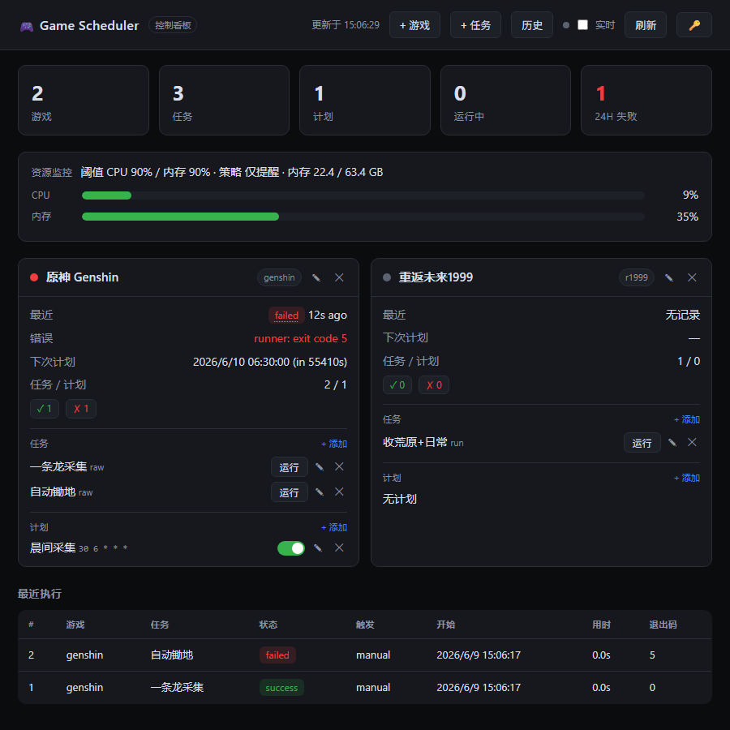

# 🎮 game-scheduler · 多游戏资源收集与路线调度器

> 🌏 **English docs: [README_EN.md](README_EN.md)** · 中文文档如下。

[](https://github.com/xiabee/game-scheduler/actions/workflows/ci.yml)
[](https://github.com/xiabee/game-scheduler/actions/workflows/security.yml)
[](go.mod)

一个**多游戏「资源收集与路线」调度器**:把你已经安装好的开源自动化工具，作为普通本地进程统一编排、定时与监控。

> ### 🔗 项目地址 → **<https://github.com/xiabee/game-scheduler>**

> ⚠️ **范围与安全边界（务必阅读）**
> 本项目**只是一个调度器**。它**不**作弊、**不**注入代码、**不**读写游戏内存、**不**抓包改包、**不**实现任何反检测能力。
> 每个被支持的工具都只当作一个**不透明的本地子进程**来启动（`os/exec`）——本项目只决定 **跑什么、什么时候跑**，并记录结果。
> 工具本身（BetterGI、March7thAssistant/Fhoe-Rail、ok-wuthering-waves、M9A）**不随本项目分发**，需你自行安装、配置、并对其使用合规性负责。

> 🛑 **免责声明**:使用任何第三方自动化工具都可能违反对应游戏的服务条款,**存在账号处罚/封禁风险**,请自行评估并承担后果。本项目仅供学习与个人效率用途,按 "AS IS" 提供(见 [LICENSE](LICENSE))。部署前请阅读 **[SECURITY.md](SECURITY.md)**(威胁模型与加固清单——特别是:能调 API 即能在本机执行命令)。

---

## ✨ 功能一览

- **四游戏适配器**:原神 / 崩铁 / 鸣潮 / 重返未来1999，各自把任务翻译成对应工具的命令行。
- **SQLite 存储**:游戏、任务、路线、计划、执行日志。
- **手动触发 + 定时任务**(标准 5 段 cron，或 `@daily`、`@every 6h` 等)。
- **串行执行队列**:这些工具共用鼠标/键盘/前台窗口,默认 `max_concurrent=1` 串行,绝不互相抢屏。
- **完整执行日志**:stdout / stderr / 退出码 / 起止时间;失败时另记错误、**截图路径**、重试次数。
- **崩溃自愈**:进程意外退出后,残留的 `running/pending` 执行在启动时被重置为 `failed`。
- **进程树终止**:取消/超时会用 `taskkill /T` 杀掉整棵子进程树,避免工具残留控制游戏。
- **控制看板**(类 Grafana):实时推送、增删改查、执行历史、失败截图缩略图——见下文。
- **REST API + CLI**(`ctl`),**可选令牌鉴权**。
- **B站攻略搜索**:看板内搜攻略视频(只读公开 API),并在本地脚本库中匹配可执行路线,一键建任务(见下文专节)。
- **角色培养计划器**:手动维护角色/目标/材料缺口,按路线资产生成刷取推荐,并一键创建任务/计划。
- **持续集成 + 定期安全扫描**:Linux/Windows 双平台测试、`-race`、`govulncheck`、Dependabot。

---

## 🧩 需要安装的自动化工具（必装，否则跑不起来）

调度器本身**不含**任何工具或游戏。请自行安装各工具,再把游戏的 `tool_path` / `working_dir` / `extra_config` 指向它。崩铁两个工具需要 `python`。

| 游戏 | 工具 | 🔗 下载地址 | 调度器需要配置 |
|------|------|-------------|----------------|
| 🌸 **原神** | BetterGI | **<https://github.com/babalae/better-genshin-impact/releases>** | `tool_path` → `BetterGI.exe`;脚本用 [**bettergi-scripts-list**](https://github.com/babalae/bettergi-scripts-list)(在 BetterGI 内订阅) |
| 🚂 **崩铁** | March7thAssistant | **<https://github.com/moesnow/March7thAssistant/releases>** | `extra_config.march7th_dir` → 项目目录(需 Python 3.12+) |
| 🚂 **崩铁** | Fhoe-Rail | **<https://github.com/linruowuyin/Fhoe-Rail>** | `extra_config.fhoe_dir` → 项目目录(也有打包版 `Fhoe-Rail.exe`,可用 `exe`/`raw_args` 指过去) |
| 🌊 **鸣潮** | ok-wuthering-waves | **<https://github.com/ok-oldking/ok-wuthering-waves/releases>** | 用 setup 安装后,`tool_path` → `ok-ww.exe` |
| 🕰️ **1999** | M9A | **<https://github.com/MAA1999/M9A/releases>** | 下 **PiCLI** 版,`tool_path` → `MaaPiCli.exe`、`working_dir` → M9A 目录;[CLI 用法](https://github.com/MAA1999/M9A/blob/main/docs/zh_cn/manual/MaaPiCli.md) |

> 装完后用 **`ctl tasks preflight <任务id>`**(或 `GET /api/tasks/{id}/preflight`)验证:它会拼出实际命令、检查可执行文件/工作目录/`extra_config` 目录/Python 入口文件是否存在,并给出 `ready`、`checks`、`missing`,**不会真的启动游戏**。

> 🔍 **不知道工具装在哪?** 用**扫描**功能自动定位:看板头部「扫描」按钮、`ctl discover [-paths "F:/Games;D:/Tools"]`、或 `POST /api/discover`。它会在磁盘里查找上述可执行文件/项目目录(只读、不执行任何东西),找到后在看板里可**一键填入新游戏**。留空路径则扫描所有磁盘;指定路径更快。

---

## ✅ 真实接入验证流程

这一步只校准外部工具调用,不启动任何注入/内存读写/封包/反检测能力。本项目始终只把已安装工具当作普通子进程运行。

1. **安装外部工具**
   - BetterGI:安装/解压后确认 `BetterGI.exe` 可手动打开。
   - March7thAssistant / Fhoe-Rail:确认 Python 版本满足工具要求,项目目录里存在入口文件(默认 `main.py`)。
   - ok-wuthering-waves:按其说明安装后确认 `ok-ww.exe` 可手动启动。
   - M9A:下载 PiCLI 版,确认 `MaaPiCli.exe` 与 M9A 项目目录可用。

2. **配置路径**
   - `tool_path`:原神/鸣潮/1999 填对应 exe;崩铁默认用 `extra_config.python_path`。
   - `working_dir`:工具需要相对资源时填写;M9A 必填项目目录。
   - `extra_config`:崩铁填 `march7th_dir` / `fhoe_dir`;需要本地脚本匹配时填 `scripts_dir`;Python 入口不是 `main.py` 时填 `march7th_entry` / `fhoe_entry`。

3. **跑 preflight**
   ```powershell
   $S = "http://127.0.0.1:8080"
   ctl -server $S tasks preflight <任务id>
   ```
   重点看:
   - `command`:最终会执行的完整命令行。
   - `checks`:逐项检查结果,包含 executable / directory / file。
   - `missing`:缺失项列表;为空且 `ready=true` 才说明路径和入口文件都对上了。

4. **手动运行一次**
   ```powershell
   ctl -server $S tasks run <任务id>
   ```
   第一次建议把游戏和工具都放在前台、关闭定时计划,确认工具自身能按预期完成。

5. **查看日志**
   ```powershell
   ctl -server $S execs list -task <任务id> -limit 5
   ctl -server $S execs get <执行id>
   ```
   执行详情里会保存 `command`、`stdout`、`stderr`、退出码、错误信息和失败截图路径。

6. **用 `raw_args` 校准参数**
   如果 preflight 的 `command` 看起来合理但工具版本不认默认参数,先在 PowerShell 里手动跑同一条命令;确认正确参数后,把任务改成 `raw` 或在原任务 params 中加入 `raw_args`:
   ```json
   {"raw_args":["--实际参数","值"]}
   ```
   需要改可执行文件或工作目录时,同一个 params 里还可以加 `"exe":"..."` / `"working_dir":"..."`。

---

## 🏗️ 架构

```
cmd/server          REST API + cron 调度器(常驻进程)
cmd/ctl             REST API 的命令行客户端
internal/config     服务端配置(JSON 文件 + 环境变量)
internal/store      SQLite 持久化(纯 Go 的 modernc.org/sqlite)
internal/runner     启动外部工具,采集 stdout/stderr/退出码
internal/task       编排:适配器 → 命令 → runner,串行队列、重试、截图
internal/scheduler  robfig/cron 引擎,把计划绑到任务
internal/events     轻量事件总线(给看板做实时推送)
internal/game       Adapter 接口 + 注册表
internal/game/{genshin,hsr,wuwa,r1999}   各工具的命令构建器
internal/api        net/http 的 JSON REST + 看板 + SSE 实时流
```

数据流:**计划(cron)** 或**手动触发** → 运行某个**任务**;任务所属**游戏**选定一个**适配器**;适配器把任务翻译成命令行;`runner` 执行,并把
`command / stdout / stderr / exit_code / start_time / end_time` 以及失败时的 `error_msg / screenshot_path / retry_count` 记成一条**执行记录**。

---

## 🚀 构建与运行

```powershell
go build -o bin/server.exe ./cmd/server
go build -o bin/ctl.exe    ./cmd/ctl
```

需要 Go 1.26.4+。无需 cgo(SQLite 驱动是纯 Go)。

```powershell
# 默认用 ./data 存放 db/日志/截图,监听 127.0.0.1:8080
./bin/server.exe

# 或指定配置文件 / 覆盖监听地址
./bin/server.exe -config config.json -addr 127.0.0.1:8080
```

配置优先级:默认值 → `config.json`(见 `config.example.json`) → 环境变量
(`GS_ADDR`、`GS_DATA_DIR`、`GS_DB_PATH`、`GS_SCREENSHOT_CMD`、`GS_MAX_CONCURRENT`、`GS_AUTH_TOKEN`、`GS_MONITOR_ENABLED`、`GS_CPU_THRESHOLD`、`GS_MEM_THRESHOLD`、`GS_MONITOR_INTERVAL_SEC`、`GS_OVERLOAD_POLICY`、`GS_NOTIFY_CMD`) → `-addr` 参数。

### 并发(重要）

`max_concurrent`(默认 **1**)限制同时运行的执行数。这些工具都要操作**共用的鼠标/键盘和前台窗口**,同时跑两个会互相抢屏。默认情况下第二次触发会**排队**(记为 `pending`),等当前这次跑完才开始。只有当你的执行确实跑在**相互独立的机器/虚拟机**上时才需要调大。

### 失败截图

`screenshot_cmd` 是可选的、尽力而为的观测钩子,任务失败时执行,`{{.Path}}` 会被替换为目标 PNG 路径。它**不碰游戏**,只是抓个屏方便排查。Windows 全屏示例:

```json
{
  "screenshot_cmd": "powershell -NoProfile -Command \"Add-Type -AssemblyName System.Windows.Forms,System.Drawing; $b=[System.Windows.Forms.SystemInformation]::VirtualScreen; $bmp=New-Object System.Drawing.Bitmap($b.Width,$b.Height); $g=[System.Drawing.Graphics]::FromImage($bmp); $g.CopyFromScreen($b.Location,[System.Drawing.Point]::Empty,$b.Size); $bmp.Save('{{.Path}}')\""
}
```

不设置时,路径仍会被记录(布局可预期),但不会真的生成图片。命令通过 `cmd /S /C` 执行,因此含引号的命令(如上面的 PowerShell 一行)也能正确运行。

---

## 🔐 鉴权

默认 API **无鉴权**——仅在绑定到 localhost(默认)时才安全。要对外暴露,请用 `auth_token`(配置)或 `GS_AUTH_TOKEN` 设置令牌。设置后,所有 `/api/*` 与 `/screenshots/*` 都需令牌;看板页面(`/`)与 `/healthz` 保持开放。

- **API / CLI**:发送 `Authorization: Bearer <令牌>`(CLI:`ctl -token <令牌> …`,或 `GS_TOKEN`)。
- **浏览器**:看板首次遇到 401 会弹框输入令牌并存入 `localStorage`;🔑 按钮可随时设置/修改。实时流通过 `?token=` 鉴权(浏览器的 EventSource 无法发自定义头)。

> 令牌只是**单一共享密钥**,适合可信局域网。对外网/多用户,建议在前面再挂一个做 TLS + 真实认证的反向代理。

---

## 📊 控制看板

浏览器打开服务器地址 —— **<http://127.0.0.1:8080/>** —— 即是一个类 Grafana 的控制看板。它是一个内嵌单页(无需任何前端构建),通过 **Server-Sent Events**(`GET /api/stream`)**实时更新**:任何变化(开始/结束一次运行、开关计划、增删游戏/任务)服务器都会推一份新快照。若 SSE 被代理拦截,会自动退化为轮询。加 `?live=0` 可得静态快照。



它展示:

- **顶部统计**:游戏/任务/计划总数、正在运行数、近 24h 失败数(非零标红)。
- **每游戏一张卡片**,带彩色健康灯:`ok`(绿,上次成功)、`error`(红,上次失败并显示错误)、`running`(蓝色脉冲)、`warn`(已取消)、`idle`(灰,无记录)。卡片含最近运行+相对时间、下次计划、任务/计划数、成功/失败计数、禁用标记。
- **每任务「运行」按钮**:`POST /api/tasks/{id}/run`,触发后看板刷新显示排队/运行。
- **每计划开关**:就地启停 `PUT /api/plans/{id}`,调度器重载、下次运行时间实时更新。
- **执行详情弹窗**:点最近记录的任意一行(或卡片上的状态徽章),查看完整命令、错误、**stdout/stderr**、退出码、时间,以及失败**截图缩略图**(由 `/screenshots/` 提供)。若仍在运行,弹窗内有**取消**按钮(`POST /api/executions/{id}/cancel`,会杀整棵进程树)。
- **完整增删改**:头部 **+ 游戏 / + 任务** 按钮,以及每张卡上的 **+ 添加 / ✎ 编辑 / ✕ 删除**,无需命令行即可管理游戏/任务/计划。
- **图形化任务配置**:任务表单按各工具的**操作类型**下拉选择(如 BetterGI 的「一条龙/调度器配置组/JS 脚本」、ok-ww 的「一键任务(-t N)」、M9A 的「配置名(-c)」),每种类型给出对应的输入框/数字/开关,带说明文字——**不用手写 params JSON**(高级 JSON 仍保留为逃生口,手改后以其为准)。schema 由 `GET /api/meta` 下发。游戏表单同理:崩铁的 Python 路径 / March7thAssistant / Fhoe-Rail 目录都是图形字段,自动合并进 `extra_config`。
- **路线资产中心**:头部「路线」按钮可扫描本地脚本目录、搜索路线、查看标签/类型/来源、最近运行时间、成功/失败次数,并一键从路线创建任务。
- **培养计划器**:头部「培养计划」按钮维护角色、目标和材料需求,根据路线资产生成刷取推荐,并创建任务/计划。
- **执行历史**:**历史** 按钮打开可筛选的历史视图(按状态、限制条数),点行进详情弹窗。
- **资源监控面板**:顶部用**环形仪表**实时显示本机 **CPU / 内存 / 磁盘** 使用率,各带**历史曲线**(随 SSE 持续刷新);超过阈值时变红并弹出**过载横幅**(见下节)。

---

## 🗂️ 路线资产中心 v1

路线资产中心把本地脚本库里的路线文件和你收藏的攻略来源整理到 `routes` 表里。它仍然只做**资产管理 + 任务创建**,不做视频自动学习、不做画面识别、不做外挂能力。

### 路线字段

`routes` 现在保存:

- `adapter`、`route_type`、`tags`
- `file_path`、`description`
- `source_url`、`source_title`
- `last_run_at`、`success_count`、`fail_count`
- `created_at`、`updated_at`

旧 SQLite 数据库会自动迁移:只追加列和索引,不会删表重建。

### 扫描与搜索

扫描入口:

- 看板:「路线」→「扫描入库」
- CLI:`ctl routes scan [-game id]`
- API:`POST /api/routes/scan` body 可选 `{"game_id":"genshin"}`

扫描目录来自游戏配置:

- `extra_config.scripts_dir`
- `extra_config.fhoe_dir`
- `extra_config.march7th_dir`

支持文件类型:`.json` / `.js` / `.txt`。扫描时会按文件名和路径保守推断:

- `collect`:采集/材料/collect
- `farm`:锄地/刷取/farm/echo
- `daily`:每日/日常/委托/daily
- `event`:活动/event
- `abyss`:深渊/忘却/abyss
- `other`:无法判断

搜索入口:

```powershell
ctl -server $S -game genshin -q "风车菊" routes search
ctl -server $S -game genshin -type collect routes search
ctl -server $S -game genshin -tag 蒙德 routes search
```

搜索会匹配路线名、文件路径、描述、来源标题/链接和 tags。

常用 `ctl` 示例:

```powershell
$S = "http://127.0.0.1:8080"

# 扫描某个游戏的本地路线目录并入库
ctl -server $S -game genshin routes scan

# 搜索路线
ctl -server $S -game genshin -q "风车菊" routes search
ctl -server $S -game genshin -type collect routes search
ctl -server $S -game genshin -tag 蒙德 routes search

# 手工新增一条路线资产
ctl -server $S -data '{"game_id":"genshin","adapter":"genshin","route_type":"collect","tags":["蒙德","collect"],"name":"风车菊采集","file_path":"D:/routes/风车菊.json","source_url":"https://www.bilibili.com/video/BV...","source_title":"风车菊路线攻略"}' routes add

# 更新路线来源/标签
ctl -server $S -data '{"game_id":"genshin","adapter":"genshin","route_type":"collect","tags":["蒙德","风车菊"],"name":"风车菊采集","file_path":"D:/routes/风车菊.json","source_url":"https://www.bilibili.com/video/BV...","source_title":"新版路线攻略"}' routes update <路线id>

# 从路线创建任务,随后 preflight 和手动运行
ctl -server $S routes create-task <路线id>
ctl -server $S tasks preflight <任务id>
ctl -server $S tasks run <任务id>
```

### 从路线创建任务

```powershell
ctl -server $S routes create-task <路线id>
```

映射规则:

- `genshin` → `script`, params 里写入 `script=<file_path>`
- `hsr` → `fhoe_route`, params 里写入 `route=<file_path>`
- `wuwa` → `farm`, 使用 `task_index=1` 和路线名
- `r1999` → `run`, daily/farm 路线会把路线名作为 `config`

创建出的任务会带 `route_id`。执行结束后,如果任务关联路线,会自动更新该路线的 `last_run_at`、`success_count` 或 `fail_count`。

---

## 🧪 角色培养计划器 v1

角色培养计划器是一个**手动维护 + 推荐生成**模块:你录入角色、培养目标、材料需求和已有数量,系统计算材料缺口,再用路线资产中心里的 `route_type` / `tags` / `source_title` / 描述做匹配,生成刷取建议。它不会自动识别背包或角色状态,也不会接入游戏画面识别。

### 功能说明

新增数据:

- `characters`:角色基础信息、标签、备注。
- `character_goals`:培养目标,如等级/技能/装备目标、优先级、状态。
- `material_items`:材料、类型、`source_hint`、`route_type_hint`。
- `material_requirements`:某个目标下的需要数量、已有数量、需求优先级。
- `farming_recommendations`:生成后的刷取建议,可关联路线、任务和计划。

推荐逻辑:

- `missing = required_count - owned_count`;缺口小于等于 0 不生成建议。
- 按 `material_requirements.priority` 从高到低推荐。
- `material.route_type_hint` 匹配 `routes.route_type` 时优先。
- `material.source_hint` 会匹配路线名、tags、描述和 `source_title`。
- 找不到路线时仍生成**手动刷取建议**,但 `route_id` 为空。
- 每条建议都有 `reason`,并估算 `estimated_runs` / `estimated_stamina`。
- 支持 `daily_stamina` 和 `max_tasks` 控制一次推荐的预算和数量。

### 使用流程

1. 在「路线」里先扫描或手工维护路线资产,尽量补好 `route_type`、tags、来源标题。
2. 在「培养计划」里新增角色。
3. 给角色新增培养目标。
4. 录入材料需求:材料名、类型、需要/已有数量、优先级、`source_hint`、`route_type_hint`。
5. 点击「生成推荐」。
6. 对有 `route_id` 的推荐一键创建任务或计划;无路线建议先补路线资产或手工处理。

### API 示例

```powershell
$S = "http://127.0.0.1:8080"

Invoke-RestMethod "$S/api/characters" -Method POST -ContentType application/json -Body '{"game_id":"genshin","name":"香菱","role_type":"sub_dps","element":"pyro","weapon":"polearm","rarity":4,"tags":["深渊"]}'
Invoke-RestMethod "$S/api/character-goals" -Method POST -ContentType application/json -Body '{"character_id":1,"name":"突破90","target_level":"90","target_skill":"10/10/10","priority":5,"status":"open"}'
Invoke-RestMethod "$S/api/materials" -Method POST -ContentType application/json -Body '{"game_id":"genshin","name":"绝云椒椒","category":"collect","source_hint":"绝云","route_type_hint":"collect"}'
Invoke-RestMethod "$S/api/material-requirements" -Method POST -ContentType application/json -Body '{"goal_id":1,"material_id":1,"required_count":168,"owned_count":42,"priority":8}'
Invoke-RestMethod "$S/api/planner/recommend" -Method POST -ContentType application/json -Body '{"goal_id":1,"daily_stamina":160,"max_tasks":3}'
Invoke-RestMethod "$S/api/planner/recommendations?goal_id=1"
Invoke-RestMethod "$S/api/planner/recommendations/1/create-task" -Method POST
Invoke-RestMethod "$S/api/planner/recommendations/1/create-plan" -Method POST -ContentType application/json -Body '{"cron_expr":"0 9 * * *"}'
```

### CLI 示例

```powershell
$S = "http://127.0.0.1:8080"

ctl -server $S -data '{"game_id":"genshin","name":"香菱","role_type":"sub_dps","element":"pyro","weapon":"polearm","rarity":4,"tags":["深渊"]}' characters add
ctl -server $S characters list

ctl -server $S -data '{"character_id":1,"name":"突破90","target_level":"90","target_skill":"10/10/10","priority":5,"status":"open"}' goals add
ctl -server $S -character 1 goals list

ctl -server $S -data '{"game_id":"genshin","name":"绝云椒椒","category":"collect","source_hint":"绝云","route_type_hint":"collect"}' materials add
ctl -server $S -data '{"goal_id":1,"material_id":1,"required_count":168,"owned_count":42,"priority":8}' requirements add
ctl -server $S -goal 1 requirements list

ctl -server $S -data '{"goal_id":1,"daily_stamina":160,"max_tasks":3}' planner recommend
ctl -server $S -goal 1 planner recommendations
ctl -server $S planner create-task <推荐id>
ctl -server $S -data '{"cron_expr":"0 9 * * *"}' planner create-plan <推荐id>
```

### 看板使用说明

头部「培养计划」按钮打开计划器。当前 v1 是轻量内嵌 UI:

- 左侧维护角色,右侧维护培养目标。
- 下方录入材料需求;材料会写入 `material_items`,需求写入 `material_requirements`。
- 推荐表展示标题、原因、关联路线、预计次数、预计体力和状态。
- 推荐可创建任务、创建计划、标记完成或忽略。

### 限制

- 不自动识别背包材料数量。
- 不自动识别角色等级/技能/装备状态。
- 不读写游戏内存、不抓包、不封包、不注入、不反检测。
- 本阶段不依赖 OCR/YOLO;后续可以在安全边界内扩展截图识别辅助录入,但执行仍只通过外部工具任务。

---

## 📺 B站攻略搜索与路线导入

> **功能定位(请先读)**:本功能**不会**"AI 看视频后自动打游戏"——把任意视频转成游戏操作等于自研一套视觉自动化引擎,超出本项目"只编排、不实现自动化"的边界,也不可靠。
> 实际闭环是:**搜攻略视频给人看 → 匹配本地脚本库里同名/同主题的可执行路线 → 一键建任务交给工具执行**。社区脚本库(如 bettergi-scripts-list)本来就是攻略视频的配套产物,这是攻略到自动化最可靠的桥。

### 它能做什么

| 你的目标 | 怎么落地 |
|---|---|
| 跑图 / 材料收集 | 「攻略」里搜关键词(如 `风车菊`)→ B站视频供参考 + 本地脚本库匹配出 `风车菊采集路线.json` → **建任务**(自动预填 BetterGI `script` 类型) |
| 锄大地路线 | hsr 配置 `fhoe_dir` 后同样按文件名匹配 Fhoe-Rail 路线 → 建 `fhoe_route` 任务 |
| 主线 / 支线 | 视频供人看;自动执行走 BetterGI 一条龙/自动剧情、M9A 常规作战等**工具自带能力**(建对应类型任务即可) |
| 活动速刷 | 搜「活动名 + 速刷」看视频;若社区脚本库已出对应脚本,匹配后一键建任务 |
| 收藏攻略 | 视频「收藏」按钮 → 存入路线资产中心的 `source_url` / `source_title` |

### 部署

无需额外组件。只要:

1. 服务器能**出站 HTTPS 访问 `api.bilibili.com`**(只读公开搜索、不登录、无凭据;这是本项目唯一的出站请求)。
2. 给游戏配置**本地脚本库目录**(没有它就只有视频、没有可执行匹配):
   - 原神:`git clone https://github.com/babalae/bettergi-scripts-list`,然后在游戏的 `extra_config` 里设 `{"scripts_dir":"<克隆目录>"}`(看板编辑游戏 → 高级 extra_config);
   - 崩铁:已配置的 `fhoe_dir` / `march7th_dir` 自动作为匹配目录;
   - 也可以把任意自己录制的路线文件夹设为 `scripts_dir`。

### 使用

- **看板**:头部「**攻略**」按钮 → 选游戏、输关键词 → 上半区 B站视频(新窗口打开/收藏),下半区本地匹配(**建任务** 自动按适配器预填:原神→`script`、崩铁→`fhoe_route`;**存为路线** 记入路线资产中心)。
- **CLI**:`ctl -game genshin -q "风车菊 采集" guides`
- **API**:`GET /api/guides/search?q=<关键词>&game_id=<id>[&source=video|local|all]`

### 已知限制

- B站对匿名搜索有**风控**:可能返回空结果或 `-412`,稍等重试即可(接口会把错误如实放在 `videos_error` 字段,不影响本地匹配)。
- 本地匹配会看文件名、路径和推断标签,但仍依赖脚本库文件命名;匹配不到就去脚本库目录里自己找,或在 BetterGI 内订阅后重试。
- 视频→脚本之间**没有自动对应关系**,需要人判断"这个视频讲的就是这条路线"。

---

## 🖥️ 资源监控与过载保护

服务器内置一个轻量监控,按 `monitor_interval_sec`(默认 3 秒)采样本机 **CPU / 内存 / 磁盘**,在看板顶部用**环形仪表 + 历史曲线(sparkline)**实时展示(磁盘取数据目录所在分区,仅作展示、不参与过载判定)。这些工具会吃满 CPU/内存,机器过载时自动化容易出错、卡死甚至连环失败——本功能用来**防止资源过载**。

- **阈值**:`cpu_threshold` / `mem_threshold`(默认各 90%)。连续 2 次采样超过阈值才判定**过载**(去抖,避免瞬时尖峰误报);掉回阈值以下立即解除。
- **过载策略** `overload_policy`:
  - `alert`(默认):只在看板**红色横幅提醒**(`⚠ 资源过载:…`),不干预任务。
  - `pause`:在此基础上,**过载期间跳过新的定时任务**(调度器记日志并在看板标注「已暂停定时任务」),手动触发不受影响;资源回落后自动恢复。
- 纯只读观测 + 调度闸门,**不碰游戏或工具**;只看 CPU/内存(`gopsutil`),不读进程内存。
- 相关配置:`monitor_enabled`、`cpu_threshold`、`mem_threshold`、`monitor_interval_sec`、`overload_policy`(对应环境变量 `GS_MONITOR_ENABLED`、`GS_CPU_THRESHOLD`、`GS_MEM_THRESHOLD`、`GS_MONITOR_INTERVAL_SEC`、`GS_OVERLOAD_POLICY`)。实时数据也在 `GET /api/dashboard` 的 `resource` 字段中。

---

## 🔔 通知提醒(notify_cmd)

看板上的红色横幅只有盯着屏幕才看得到。配置 `notify_cmd`(或 `GS_NOTIFY_CMD`)后,在**任务失败**和**资源过载**时会执行一条你指定的命令,把提醒推送出去(Windows 通知、企业微信/钉钉机器人、Bark、ServerChan、webhook 等都行)。

模板字段(均已**净化 shell 特殊字符**,防止动态文本破坏命令或注入):`{{.Event}}`(如 `task_failed` / `overload`)、`{{.Title}}`、`{{.Message}}`。

示例 —— Windows 弹原生通知(需 PowerShell 模块 `BurntToast`):
```json
{ "notify_cmd": "powershell -NoProfile -Command \"New-BurntToastNotification -Text '{{.Title}}','{{.Message}}'\"" }
```
示例 —— 推送到 webhook / Bark:
```json
{ "notify_cmd": "curl -s -X POST https://example.com/notify -d \"event={{.Event}}&title={{.Title}}&msg={{.Message}}\"" }
```
不设置时不发任何通知。命令尽力而为执行,失败只记日志,**不会影响任务本身**。

---

## 🖥️ 命令行(`ctl`)

> 全局参数(`-server`、`-token`、`-data`、`-game` …)必须放在**资源/动作之前**,例如 `ctl -server http://... -data '{...}' games add`。服务器开启鉴权时传 `-token`(或 `GS_TOKEN`)。

```
ctl [-server URL] [-token T] <资源> <动作> [id]

games   list | get <id> | add | update <id> | delete <id>
tasks   list [-game id] | get <id> | add | update <id> | delete <id> | run <id> | preflight <id>
routes  list/search [-game id] [-q text] [-type t] [-tag tag] | add | update <id> | delete <id> | scan [-game id] | create-task <id>
plans   list | get <id> | add | update <id> | delete <id>
execs   list [-task id] [-status s] [-limit n] | get <id> | cancel <id>
discover [-paths "F:/Games;D:/Tools"]    扫描磁盘查找工具
guides   -q "<关键词>" [-game id]         B站攻略搜索 + 本地路线匹配
characters list [-game id] | get <id> | add | update <id> | delete <id>
goals    list [-character id] [-game id] [-status s] | get <id> | add | update <id> | delete <id>
materials list [-game id] [-category c] | get <id> | add | update <id> | delete <id>
requirements list [-goal id] | get <id> | add | update <id> | delete <id>
planner  recommend | recommendations [-goal id] [-game id] [-status s] [-limit n]
         | create-task <id> | create-plan <id> | dismiss <id> | complete <id>
health
```

`add`/`update` 从 `-data '<json>'` 或 `-data -`(stdin)读取请求体。`-server` 默认 `$GS_SERVER` 或 `http://127.0.0.1:8080`。

---

## 🌐 REST API

| 方法与路径 | 用途 |
|---|---|
| `GET /healthz` | 存活探针 + 已注册适配器 |
| `GET/POST /api/games`、`GET/PUT/DELETE /api/games/{id}` | 游戏增删改查 |
| `GET/POST /api/tasks`、`GET/PUT/DELETE /api/tasks/{id}` | 任务增删改查(`?game_id=`) |
| `POST /api/tasks/{id}/run` | **手动触发**(返回 pending 执行) |
| `GET /api/tasks/{id}/preflight` | 拼命令并检查可执行文件/目录/Python 入口,返回 `checks` 与 `missing`,**不运行** |
| `GET/POST /api/routes`、`PUT/DELETE /api/routes/{id}` | 路线资产(`?game_id=&q=&type=&tag=`) |
| `POST /api/routes/scan` | 扫描 `scripts_dir` / `fhoe_dir` / `march7th_dir` 入库 |
| `GET /api/routes/search` | 路线搜索(`?q=&game_id=&type=&tag=`) |
| `POST /api/routes/{id}/create-task` | 从路线资产创建关联任务 |
| `GET/POST /api/plans`、`GET/PUT/DELETE /api/plans/{id}` | 定时计划(cron 会校验) |
| `GET /api/executions`、`GET /api/executions/{id}` | 执行日志(`?task_id=&status=&limit=`) |
| `POST /api/executions/{id}/cancel` | 取消运行中的执行 |
| `GET /api/dashboard` | 看板聚合快照(各游戏健康、计划、最近执行) |
| `GET /api/stream` | SSE 实时推送看板更新 |
| `GET /api/meta` | 适配器键 + 任务类型(给表单用) |
| `POST /api/discover` | 扫描磁盘查找工具可执行文件(body 可选 `{"paths":[...],"max_depth":N}`) |
| `GET /api/guides/search` | B站攻略视频搜索 + 本地路线匹配(`?q=&game_id=&source=`) |
| `GET /screenshots/{name}` | 取失败截图(受鉴权保护) |

---

## ⚙️ 各适配器的任务配置

> 💡 用看板的话**不需要记下面这些**:任务表单会按类型渲染图形字段。下表供 API/CLI 直接调用时参考。

每个任务有一个 `type`(由适配器解释)和一个 `params`(JSON 字符串)。所有适配器都提供两个万能逃生口:

- `"exe": "<路径>"` —— 覆盖本任务的可执行文件。
- `"raw_args": ["...", "..."]` —— 直接给出**完整命令行参数**,绕过适配器默认值。**当你的工具版本参数和文档默认值不一致时就用它**(各工具 CLI 参数会随版本变)。

### 🌸 genshin(BetterGI) —— `tool_path = BetterGI.exe`
| type | params | 默认参数 |
|---|---|---|
| `onedragon` | `{"group":"<名>"}`(可选) | `--startOneDragon [--group <名>]` |
| `config_group` | `{"group":"<名>"}` | `--startGroup <名>` |
| `script` | `{"script":"<名或路径>"}` | `--script <名>` |
| `raw` | `{"raw_args":[...]}` | 原样 |

### 🚂 hsr(March7thAssistant / Fhoe-Rail) —— Python 项目
`extra_config`:
```json
{ "python_path":"python",
  "march7th_dir":"C:/.../March7thAssistant", "march7th_entry":"main.py",
  "fhoe_dir":"C:/.../Fhoe-Rail", "fhoe_entry":"main.py" }
```
| type | params | 运行 |
|---|---|---|
| `march7th_daily` | — | `python <march7th_dir>/main.py` |
| `fhoe_route` | `{"route":"<文件或名>"}`(可选) | `python <fhoe_dir>/main.py [--route ...]` |
| `raw` | `{"raw_args":[...]}` | `python <raw_args...>` |

### 🌊 wuwa(ok-wuthering-waves) —— `tool_path = ok-ww.exe`
| type | params | 默认参数 |
|---|---|---|
| `task` | `{"task_index":N,"exit":true}` | `-t N [-e]` |
| `farm`(预留 RouteFarmTask) | `{"task_index":N,"route":"<名>","exit":true}` | `-t N [-r <route>] [-e]` |
| `raw` | `{"raw_args":[...]}` | 原样 |

### 🕰️ r1999(M9A MaaPiCli) —— `tool_path = MaaPiCli.exe`、`working_dir = M9A 项目目录`
| type | params | 默认参数 |
|---|---|---|
| `run` | `{"config":"<名>"}`(可选) | `[-c <名>]` |
| `config` | `{"config":"<名>"}` | `-c <名>` |
| `raw` | `{"raw_args":[...]}` | 原样 |

---

## 📝 完整示例

```powershell
$S = "http://127.0.0.1:8080"

# 1. 注册游戏（tool_path 指向你装好的 BetterGI）
ctl -server $S -data '{"id":"genshin","name":"原神","adapter":"genshin","tool_path":"D:/BetterGI/BetterGI.exe","enabled":true}' games add

# 2. 定义任务（跑一条龙配置组）
ctl -server $S -data '{"game_id":"genshin","name":"每日采集","type":"onedragon","params":"{\"group\":\"采集\"}","max_retries":1,"retry_delay_sec":30,"timeout_sec":3600,"enabled":true}' tasks add

# 3. 立刻运行
ctl -server $S tasks run 1

# 4. 每天 06:00 定时（5 段 cron，也支持 @daily / @every 6h）
ctl -server $S -data '{"name":"原神晨间","task_id":1,"cron_expr":"0 6 * * *","enabled":true}' plans add

# 5. 查看日志
ctl -server $S execs list -task 1
```

---

## ⏰ cron 格式

标准 5 段 cron(`分 时 日 月 周`),外加 robfig/cron 描述符(`@hourly`、`@daily`、`@weekly`、`@every 6h` …)。时间用服务器本地时区。创建/更新时会校验表达式。

---

## 🧪 开发与持续集成

```powershell
go test ./...        # 单元 + 集成测试(store / runner / 适配器 / task / api)
go test -race ./...  # 竞态检测(Linux/macOS,或装了 C 工具链的 Windows)
gofmt -l .           # 应当无输出
go vet ./...
```

- **CI**([.github/workflows/ci.yml](.github/workflows/ci.yml)):gofmt + vet,在 **Linux 与 Windows** 双平台构建+测试(让 `*_windows.go` 在真 Windows 上被检查),并在 Linux 上跑 `-race`。
- **安全**([.github/workflows/security.yml](.github/workflows/security.yml)):每次推送/PR + **每周定时**跑 [`govulncheck`](https://pkg.go.dev/golang.org/x/vuln/cmd/govulncheck) 扫描依赖与标准库漏洞。
- **Dependabot**([.github/dependabot.yml](.github/dependabot.yml)):每周自动为 Go 依赖与 GitHub Actions 提更新 PR。

---

## 🔒 安全说明

- 本项目**不实现任何**注入/内存读写/抓包/反检测能力;外部工具一律按子进程启动。
- 任务的 `raw_args` / `exe` 可执行任意命令——这是本工具的**核心用途**(运行你配置的外部工具)。因此:**开启鉴权后**才暴露 API,**令牌不要泄露**;能调用 API 的人即可在本机运行命令。
- `/screenshots/` 做了路径穿越防护(只接受纯文件名);令牌比较用常量时间;SQL 全部参数化。
- 漏洞由 `govulncheck`(CI + 定时)与 Dependabot 持续监控。

---

## ⚠️ 已知限制(MVP)

- 各工具 CLI 参数随版本变化;适配器默认值是常见写法的最佳猜测——拿不准就用 `raw_args` 写死。
- API 鉴权是单一共享令牌;多用户/公网请用反向代理做真正的认证 + TLS。
- SQLite 为简化使用单写连接(WAL 模式)。
